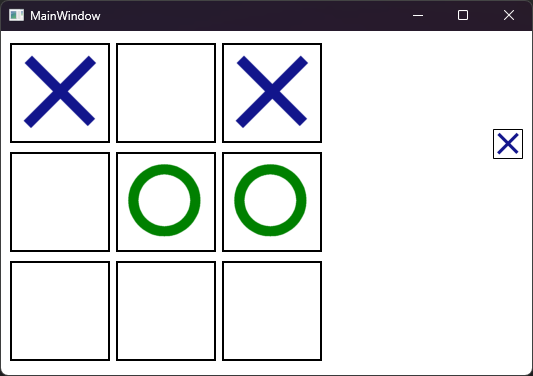
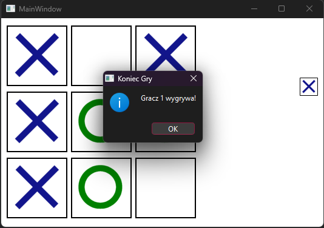

# Tic Tac Toe Game in Qt

 


A classic Tic Tac Toe game implemented using the Qt framework. This application allows two players to play against each other on a 3x3 grid. The game features a simple and intuitive interface, with visual feedback for player moves and win conditions.

---

## Table of Contents

- [Features](#features)
- [Screenshots](#screenshots)
- [Installation](#installation)
- [Usage](#usage)
- [Game Logic](#game-logic)
- [Contributing](#contributing)
- [License](#license)
- [Contact](#contact)

---

## Features

- **Two-Player Gameplay:** Play against a friend on the same device.
- **Win Detection:** Automatically detects when a player wins.
- **Reset Game:** Start a new game at any time with the "New Game" button.
- **Visual Feedback:** Displays player icons (X and O) and highlights the current player's turn.
- **Simple Interface:** Easy-to-use and visually appealing design.

---

## Screenshots

  
*Game in progress with Player 1 (X) and Player 2 (O).*

  
*Game over with a win condition for Player 2 (O).*

---

## Installation

To run the Tic Tac Toe game, follow these steps:

1. **Ensure Qt is installed:**
   - Download and install the Qt framework from [https://www.qt.io/download](https://www.qt.io/download).

2. **Clone the repository:**
   ```bash
   git clone https://github.com/m1keem/tictactoe.git

3. **Navigate to the project directory:**
   ```bash
   cd tictactoe
   
4. **Open the project in Qt Creator:**
   Launch Qt Creator and open the CMakeLists.txt or .pro file (if available).
   
5. **Build and run the project:**
   Click the "Run" button in Qt Creator to compile and launch the game.

---

## Usage

1. **Start the Game:**
- Launch the application to begin a new game.

2. **Player Turns:**
- Player 1 is X, and Player 2 is O.
- Click on any empty cell to place your symbol.

3. **Winning the game**
- The first player to get three of their symbols in a row (horizontally, vertically, or diagonally) wins.

4. **New Game**
- Click the "New Game" button to reset the board and start a new match.

---

## Game Logic

The game logic is implemented in the MainWindow class. Key functions include:

- clicked(): Handles button clicks and updates the game state.

- newGame(): Resets the game board and clears player moves.

- isWin(): Checks for a win condition by evaluating the game board.

The game board is represented by an array (data_tab) where:

- 0 represents an empty cell.

- 1 represents Player 1 (X).

- 2 represents Player 2 (O).

---

## Contributing

Contributions are welcome! If you'd like to contribute to this project, please follow these steps:

1. Fork the repository.
2. Create a new branch (`git checkout -b feature/YourFeatureName`).
3. Commit your changes (`git commit -m 'Add some feature'`).
4. Push to the branch (`git push origin feature/YourFeatureName`).
5. Open a pull request.

Please ensure your code follows the existing style and includes appropriate documentation.

---

## License

This project is licensed under the MIT License. See the [LICENSE](LICENSE) file for details.

---

## Contact

If you have any questions or suggestions, feel free to reach out:

- **MikeEm** - [My Github](https://github.com/m1keem)
- **Project Link** - [Repository](https://github.com/m1keem/tictactoe)
